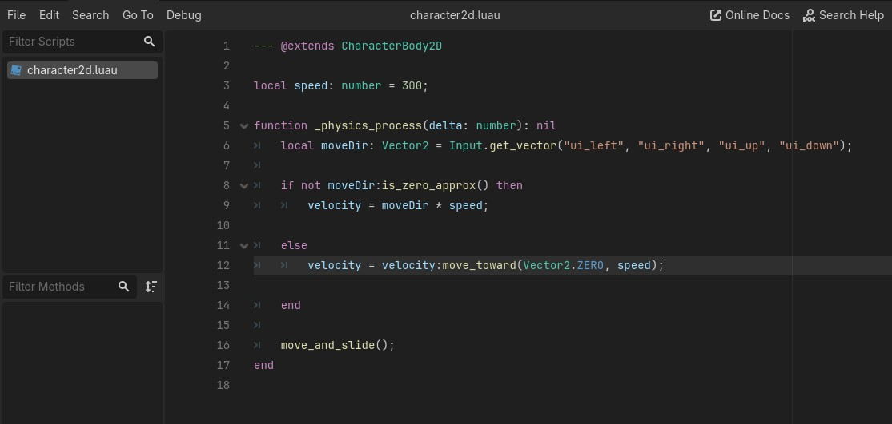

# LuauGDExtension 
GD Extension for using Luau as a scripting language. Including syntax highlighting in editor.

## Examples
See the `demo` folder for more examples.

**Basic 2D Character Controller**



**Syntax and Typing**
```luau
--- @extends Sprite2D   -- script's node

-- comment
ACONST = 123; -- Constant
local BCONST = 345; -- Local constant
acount = 1; -- Exported variable
local bcount: number = 0; -- Local variable with type annotation

-- env = self
function _init()
	print("[luau] init!", self, self.name, typeof(self));
    -- Prints> [luau] init! { "__godot_owner": <null>, "_init": <null>, "__godot_script": <null>, "_ready": <null>, "_process": <null>, "ACONST": 123.0, "acount": 1.0 } Dictionary
end


function _ready()
	local newSprite2D = Sprite2D{
		name = "NewSprite2D";
		offset = Vector2(0, 100);
	}; -- Creates a new Sprite2D node and assigns its properties
	newSprite2D.texture = self.texture; -- Assigns the texture of the new Sprite2D to the texture of the current node
	add_child(newSprite2D); -- == self.add_child(newSprite2D);
end


function _process(delta: number)
	rotate(0.02);   -- Same as self.rotate(0.02);

	totalDelta = totalDelta + delta;

	local s = (sin(totalDelta)+1)/2;
	modulate = red:lerp(blue, s);   -- Set's self.modulate
end

```

## Status
In development, not ready for use. This is a proof of concept and for enthusiasts development. Contributions are welcome!
