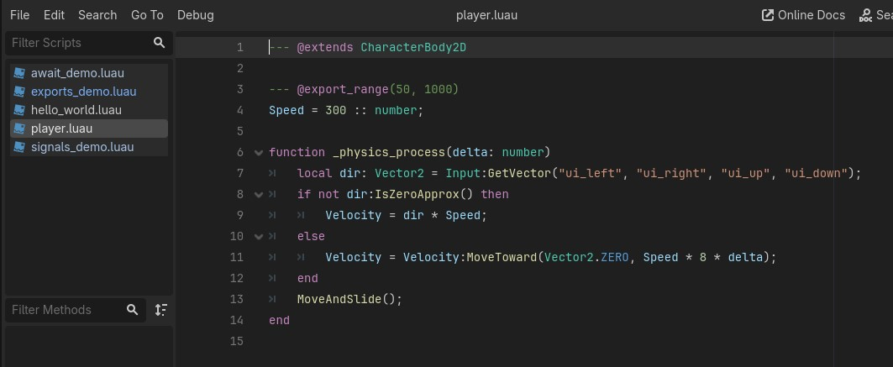

# LuauGDExtension 
GDExtension for using Luau as a scripting language. Including syntax highlighting in editor.

## Examples
See the `demo` folder for more examples.

**Basic 2D Character Controller**



**Syntax and Typing**
```luau
--- @extends Sprite2D   -- script's node

-- comment
ACONST = 123; -- Constant
local BCONST = 345; -- Local constant

--- @export_range(0, 1000) -- number range annotation for editor
ACount = 321 :: number; -- Exported variable, accessible on inspector

local bCount: number = 654; -- Local variable

OnPing = signal("OnPing"); -- Custom signal

-- env = self
function _init()
	print("[luau] init!", self, typeof(self));
end


function _ready()
	local newSprite2D = Sprite2D{
		name = "NewSprite2D";
		offset = Vector2(0, 100);
	}; -- Creates a new Sprite2D node and assigns its properties

	newSprite2D.Texture = Texture; -- Assigns the texture of the new Sprite2D to the texture of the current node
	AddChild(newSprite2D); -- == self:AddChild(newSprite2D);

	Ping:Connect(onPingFunc); -- Connecting to a signal
	Run();
end


function onPingFunc(value: number)
	print(`[luau] ping {count}`); -- prints "[luau] ping 42"
end


function Run()
	await(1); -- Custom global function, await(number | Signal | nil): nil -- Suspends this coroutine for 1 second
	OnPing:Emit(42); -- Fire a signal to OnPing
end


function _process(delta: number)
	Rotate(0.02);   -- Same as self:Rotate(0.02);

	totalDelta += delta;

	local s = (sin(totalDelta)+1)/2;
	modulate = Color.RED:Lerp(Color.BLUE, s);   -- Set's self.modulate
end

```

## Status
In development, not ready for use. This is a proof of concept and for enthusiasts development. Contributions are welcome!
